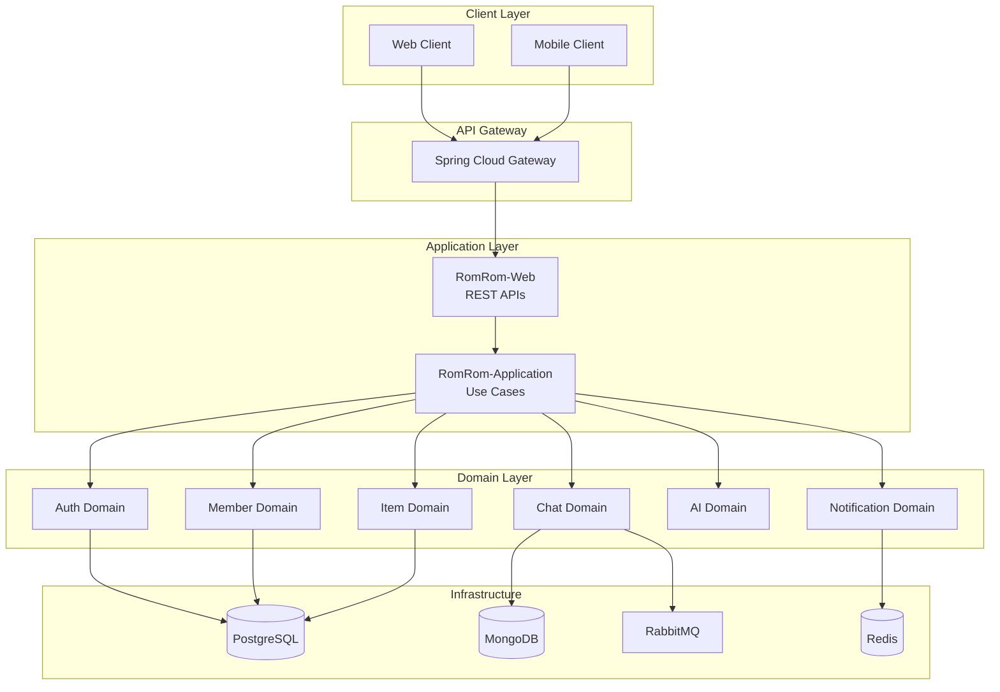

# 🚀 RomRom-BE - 차세대 모듈형 엔터프라이즈 백엔드 솔루션

<div align="center">


<!-- 자동 동기화 버전 정보 -->
<!-- 수정하지마세요 자동으로 동기화 됩니다 -->
## 최신 버전 : v1.4.2 (2026-02-09)
[🔗 전체 버전 기록](CHANGELOG.md)

</div>

## 📋 목차
- [⚡ 프로젝트 핵심 가치](#-프로젝트-핵심-가치)
- [🎯 프로젝트 개요](#-프로젝트-개요)
- [🏗️ 시스템 아키텍처](#️-시스템-아키텍처)
- [📦 모듈 구조 및 설명](#-모듈-구조-및-설명)
- [💡 핵심 기능](#-핵심-기능)
- [🛠️ 기술 스택](#️-기술-스택)
- [🚀 시작하기](#-시작하기)
- [📚 개발 가이드](#-개발-가이드)
- [📊 API 문서](#-api-문서)

---

## ⚡ 프로젝트 핵심 가치

<table>
<tr>
<td width="25%" align="center">
<h3>🏛️ 견고한 아키텍처</h3>
<p>DDD + 헥사고날 아키텍처로<br/>비즈니스 복잡성 관리</p>
</td>
<td width="25%" align="center">
<h3>📈 확장성</h3>
<p>멀티모듈 구조로<br/>무한한 확장 가능성</p>
</td>
<td width="25%" align="center">
<h3>⚡ 실시간 통신</h3>
<p>WebSocket + RabbitMQ로<br/>실시간 메시징 구현</p>
</td>
<td width="25%" align="center">
<h3>🤖 AI 통합</h3>
<p>Vertex AI 기반<br/>지능형 추천 시스템</p>
</td>
</tr>
</table>

## 🎯 프로젝트 개요

**RomRom-BE**는 현대적인 엔터프라이즈 애플리케이션을 위한 차세대 백엔드 플랫폼입니다. 도메인 주도 설계(DDD)와 헥사고날 아키텍처를 기반으로 구축되어 높은 확장성과 유지보수성을 제공합니다.

### 주요 특징
- ✅ **모듈형 설계**: 11개의 독립적인 도메인 모듈로 구성
- ✅ **실시간 통신**: WebSocket + RabbitMQ 기반 채팅 시스템
- ✅ **AI 기반 추천**: Vertex AI를 활용한 벡터 임베딩 추천
- ✅ **다중 데이터베이스**: PostgreSQL + MongoDB + Redis 통합
- ✅ **완벽한 보안**: JWT + Spring Security 기반 인증/인가

## 🏗️ 시스템 아키텍처



## 📦 모듈 구조 및 설명

### 📊 모듈 의존성 매트릭스

| 모듈명 | 타입 | 주요 기능 | 핵심 기술 | 의존 모듈 |
|--------|------|-----------|-----------|-----------|
| **RomRom-Common** | 🔧 Core | 공통 유틸리티, 예외 처리 | Spring Boot, Swagger, QueryDSL | - |
| **RomRom-Domain-Member** | 👥 Domain | 회원 관리, 위치 서비스 | JPA, PostGIS | Common |
| **RomRom-Domain-Auth** | 🔐 Domain | JWT 인증, 보안 | Spring Security, JWT | Common, Member |
| **RomRom-Domain-Item** | 📦 Domain | 상품, 거래, 좋아요 | JPA, Hibernate | Common, Member |
| **RomRom-Domain-Chat** | 💬 Domain | 실시간 채팅 | WebSocket, RabbitMQ, MongoDB | Common, Auth, Item |
| **RomRom-Domain-AI** | 🤖 Domain | AI 추천, 임베딩 | Vertex AI, PG Vector | Common, Item |
| **RomRom-Domain-Notification** | 🔔 Domain | 푸시 알림 | FCM, Redis | Common, Member |
| **RomRom-Domain-Storage** | 💾 Domain | 파일 관리 | FTP, SMB, S3 | Common |
| **RomRom-Domain-Report** | 🚨 Domain | 신고 관리 | JPA | Common, Member, Item |
| **RomRom-Application** | ⚙️ App | 유스케이스 조정 | Spring | All Domains |
| **RomRom-Web** | 🌐 Web | REST API | Spring MVC, WebSocket | Application |

### 🔗 모듈 상세 설명

#### 🔧 **RomRom-Common** (공통 모듈)
- **책임**: 모든 모듈에서 사용하는 공통 기능 제공
- **주요 컴포넌트**:
  - `BaseEntity`, `BaseTimeEntity` - JPA 엔티티 베이스
  - `GlobalExceptionHandler` - 통합 예외 처리
  - `SwaggerConfig` - API 문서화 설정
  - `FileService` - FTP/SMB/S3 파일 처리
  - `Suh Libraries` 통합 - 로깅, 랜덤 엔진, API 로그

#### 💬 **RomRom-Domain-Chat** (채팅 도메인) - NEW!
- **책임**: 실시간 메시징 및 채팅방 관리
- **주요 기능**:
  - WebSocket 기반 실시간 통신
  - RabbitMQ를 통한 메시지 브로커링
  - MongoDB 기반 메시지 저장
  - STOMP 프로토콜 지원
- **핵심 컴포넌트**:
  - `ChatRoom` - 채팅방 엔티티 (PostgreSQL)
  - `ChatMessage` - 메시지 엔티티 (MongoDB)
  - `WebSocketConfig` - WebSocket 설정
  - `RabbitMqConfig` - 메시지 큐 설정

## 💡 핵심 기능

### 🎯 비즈니스 기능

<table>
<tr>
<th width="30%">기능</th>
<th width="70%">설명</th>
</tr>
<tr>
<td>🤖 <b>AI 기반 상품 추천</b></td>
<td>Vertex AI를 활용한 벡터 임베딩으로 사용자 맞춤형 상품 추천</td>
</tr>
<tr>
<td>💬 <b>실시간 채팅</b></td>
<td>WebSocket + RabbitMQ 기반의 확장 가능한 실시간 메시징 시스템</td>
</tr>
<tr>
<td>📍 <b>위치 기반 서비스</b></td>
<td>PostGIS를 활용한 지리 공간 검색 및 거리 계산</td>
</tr>
<tr>
<td>🔔 <b>푸시 알림</b></td>
<td>Firebase Cloud Messaging을 통한 실시간 알림 전송</td>
</tr>
<tr>
<td>🔐 <b>보안 인증</b></td>
<td>JWT 토큰 기반의 Stateless 인증 시스템</td>
</tr>
<tr>
<td>📊 <b>거래 관리</b></td>
<td>상품 등록, 거래 요청, 상태 추적 등 완벽한 거래 생명주기 관리</td>
</tr>
</table>

## 🛠️ 기술 스택

### 📊 기술 스택 상세

<table>
<tr>
<th width="20%">카테고리</th>
<th width="30%">기술</th>
<th width="50%">용도 및 특징</th>
</tr>
<tr>
<td rowspan="4"><b>🎨 프레임워크</b></td>
<td>Spring Boot 3.4.x</td>
<td>마이크로서비스 기반 애플리케이션 프레임워크</td>
</tr>
<tr>
<td>Spring Security</td>
<td>엔터프라이즈급 보안 및 인증/인가</td>
</tr>
<tr>
<td>Spring Data JPA</td>
<td>ORM 기반 데이터 접근 계층</td>
</tr>
<tr>
<td>Spring WebSocket</td>
<td>실시간 양방향 통신</td>
</tr>
<tr>
<td rowspan="4"><b>💾 데이터베이스</b></td>
<td>PostgreSQL + PostGIS</td>
<td>관계형 데이터 + 지리공간 데이터 처리</td>
</tr>
<tr>
<td>MongoDB</td>
<td>비정형 데이터 (채팅 메시지) 저장</td>
</tr>
<tr>
<td>Redis</td>
<td>캐싱, 세션 관리, 실시간 데이터</td>
</tr>
<tr>
<td>PG Vector</td>
<td>벡터 임베딩 저장 및 유사도 검색</td>
</tr>
<tr>
<td rowspan="3"><b>🔄 메시징</b></td>
<td>RabbitMQ</td>
<td>메시지 브로커, 이벤트 스트리밍</td>
</tr>
<tr>
<td>STOMP</td>
<td>WebSocket 메시징 프로토콜</td>
</tr>
<tr>
<td>FCM</td>
<td>모바일 푸시 알림</td>
</tr>
<tr>
<td rowspan="3"><b>🤖 AI/ML</b></td>
<td>Google Vertex AI</td>
<td>텍스트 임베딩, AI 모델 서빙</td>
</tr>
<tr>
<td>Hibernate Vector</td>
<td>벡터 데이터 ORM 매핑</td>
</tr>
<tr>
<td>임베딩 서비스</td>
<td>유사도 계산 및 추천 알고리즘</td>
</tr>
<tr>
<td rowspan="3"><b>🔧 개발도구</b></td>
<td>Gradle 8.x</td>
<td>멀티모듈 빌드 관리</td>
</tr>
<tr>
<td>Swagger/OpenAPI</td>
<td>API 문서 자동 생성</td>
</tr>
<tr>
<td>Flyway</td>
<td>데이터베이스 마이그레이션</td>
</tr>
</table>

## 🚀 시작하기

### 사전 요구사항

- Java 17+
- Gradle 8.x
- Docker & Docker Compose
- PostgreSQL 14+
- MongoDB 6+
- Redis 7+
- RabbitMQ 3.12+

### 설치 및 실행

```bash
# 1. 저장소 클론
git clone https://github.com/TEAM-ROMROM/RomRom-BE.git
cd RomRom-BE

# 2. 환경변수 설정
cp .env.example .env
# .env 파일 수정

# 3. 인프라 실행 (Docker Compose)
docker-compose up -d

# 4. 빌드
./gradlew clean build

# 5. 애플리케이션 실행
./gradlew bootRun
```

## 📚 개발 가이드

### 주요 문서

- 📘 [Flyway Migration 가이드](/docs/flyway_guideline.md) - 데이터베이스 마이그레이션 관리
- 📗 [모듈 개발 가이드](/docs/module_development.md) - 새 모듈 추가 방법
- 📙 [API 설계 가이드](/docs/api_design.md) - RESTful API 설계 원칙
- 📕 [보안 가이드](/docs/security_guide.md) - 보안 모범 사례

### 개발 규칙

1. **브랜치 전략**: Git Flow (main, develop, feature/*, hotfix/*)
2. **커밋 메시지**: Conventional Commits 규약 준수
3. **코드 리뷰**: 모든 PR은 최소 1명 이상의 리뷰 필요
4. **테스트**: 단위 테스트 커버리지 80% 이상 유지

## 📊 API 문서

### Swagger UI 접근

| 환경 | URL |
|------|-----|
| Production | https://api.romrom.xyz/docs/swagger |
| Test | https://api.test.romrom.xyz/docs/swagger |
| Local | http://localhost:8080/docs/swagger |

### 주요 API 엔드포인트

| 도메인 | 경로 | 설명 |
|--------|------|------|
| Auth | `/api/v1/auth/**` | 인증/인가 관련 |
| Member | `/api/v1/members/**` | 회원 관리 |
| Item | `/api/v1/items/**` | 상품 관리 |
| Chat | `/api/v1/chat/**` | 채팅 관리 |
| WebSocket | `/ws` | WebSocket 연결 |
| Notification | `/api/v1/notifications/**` | 알림 관리 |

---

<div align="center">

**Made with ❤️ by TEAM-ROMROM**

[🌐 Website](https://romrom.xyz) | [📧 Contact](mailto:contact@romrom.xyz) | [📖 Documentation](https://docs.romrom.xyz)

</div>
