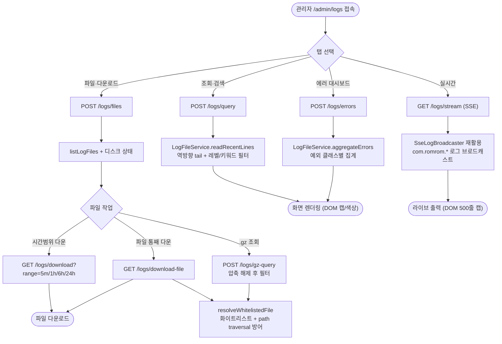

# ⚙️[기능추가][Admin] 관리자 로그 관리 화면 추가

## 개요

서버에 SSH로 접속해 `/mnt/romrom/logs/` 에서 `tail`/`grep`/`zcat`/`scp` 로 처리하던 로그 작업을 전부 관리자 웹(`/admin/logs`) 화면에서 끝낼 수 있도록 했다. 로그는 이미 파일(`romrom.log` + 날짜별 `.gz` 롤링)로 쌓이므로 **DB 적재 없이 파일을 직접 읽어** 제공한다. 조회·검색, 에러 추합 대시보드, 실시간 라이브 tail, 파일 목록 추적, 시간범위/파일 단위 다운로드, `.gz` 압축 해제 조회를 4개 탭으로 제공한다. 기존 앱 테스트빌드용 SSE 디버그 스트림 인프라(`SseLogBroadcaster`/`SseLogAppender`)는 그대로 재활용하되 관리자 인증 경로로 통합했다.

## 기능 흐름

## 변경 사항

### 로그 파일 읽기 코어 (RomRom-Application)
- `util/LogLineParser.java` (신규): 로그 한 줄을 `{loggedAt, logLevel, loggerName, logMessage, rawLine}` 로 파싱. logback 포맷(`%d [%thread] %-5level %logger - %msg`)과 1:1. 멀티라인 스택트레이스는 직전 로그 message에 결합.
- `dto/LogLineParsed.java` (신규): 파싱 결과 값 객체.
- `service/LogFileService.java` (신규): 파일 직접 읽기 핵심 서비스.
  - `readRecentLines`: `RandomAccessFile`로 끝에서 최대 4MB 블록만 읽어 UTF-8 디코딩(한글 안전, 전체 메모리 로드 금지) 후 레벨/키워드 필터.
  - `aggregateErrors`: 최근 N분 ERROR/WARN을 예외 클래스명별로 집계(발생횟수/마지막발생/대표메시지).
  - `listLogFiles` + `getDiskFreeBytes`/`getDiskTotalBytes`/`getLogTotalSizeBytes`: 파일 목록 + 용량/디스크 상태.
  - `readGzLines`: `.gz` 압축 해제 후 필터 (`zcat | grep` 대체).
  - `extractByTimeRange`: 최근 5분/1h/6h/24h 라인만 추출.
  - `getLogFileResource` + `resolveWhitelistedFile`: 화이트리스트 검증 + path traversal 방어 후 다운로드.

### DTO 확장 (RomRom-Application)
- `dto/AdminRequest.java`: 로그 관련 필드 추가 (`logLineCount`, `logLevelFilter`, `logKeyword`, `logErrorWithinMinutes`, `logFileName`).
- `dto/AdminResponse.java`: 로그 응답 필드 + 내부 클래스 `AdminLogFileInfo`/`AdminLogErrorSummary` 추가.

### API/페이지 (RomRom-Web)
- `controller/api/AdminApiController.java`: 로그 엔드포인트 7종 추가 — `/logs/query`, `/logs/errors`, `/logs/files`, `/logs/gz-query`(POST multipart), `/logs/download`, `/logs/download-file`(GET 파일), `/logs/stream`(SSE, 기존 `SseLogBroadcaster` 재활용). `@ApiChangeLog`/`@Operation` 문서화 포함.
- `controller/view/AdminPageController.java`: `GET /admin/logs` 라우트 추가.
- `resources/templates/admin/layout.html`: 사이드바 "로그 관리" 메뉴(scroll-text 아이콘) 추가.
- `resources/templates/admin/logs.html` (신규): DaisyUI 탭 4개 화면.
- `resources/static/js/admin-logs.js` (신규): 브라우저 부하 최소화 로직.

### 보안 (RomRom-Domain-Auth)
- `dto/SecurityUrls.java`: 로그 관리 경로 8종을 `ADMIN_PATHS`에 등록.

## 주요 구현 내용

- **파일 직접 읽기 (DB 없음)**: 로그가 이미 파일로 쌓이므로 별도 적재 없이 그 파일을 읽어 제공 — 운영 부담 최소.
- **대용량 안전 tail**: 끝에서 ≤4MB 블록만 seek 후 UTF-8 일괄 디코딩 → 100MB 파일이어도 전체 로드 없이 마지막 N줄. 한글 멀티바이트 깨짐 방지.
- **브라우저 부하 최소화**: 실시간 탭 DOM 라인 500줄 ring buffer 상한, 실시간 탭 활성 시에만 SSE 연결(탭 이탈·백그라운드 시 자동 해제 후 복귀 시 재연결), `requestAnimationFrame` 배칭으로 reflow 폭주 방지.
- **기존 SSE 재활용**: 앱 테스트빌드용 `SseLogBroadcaster`(최대 10 구독자, 초당 100건 rate limit)를 관리자 인증 경로 `/api/admin/logs/stream`로 노출. SSE는 `EventSource` 특성상 쿠키 `accessToken`으로 인증.
- **path traversal 방어**: 다운로드/`.gz` 조회 시 `listLogFiles()` 화이트리스트에 있는 파일명만 허용 + 로그 디렉터리 하위 경로로만 resolve(`normalize`/`startsWith` 검증).

## 주의사항

- **빌드/테스트 검증 필요**: 작업 환경이 내부망(외부 Nexus 접근 불가)이라 `./gradlew` 빌드·테스트를 실행하지 못했다. 코드 정독 리뷰로 전 파일 간 시그니처/타입/import 정합성은 확인했으나, 실제 컴파일 및 단위테스트(`LogLineParserTest`, `LogFileServiceTest`)는 서버 빌드 환경에서 최종 검증이 필요하다.
- **단일 인스턴스 전제**: 접속한 서버 인스턴스의 로그 파일만 보인다. 멀티 인스턴스 환경이라면 인스턴스별로 보이는 로그가 다르다.
- **범위 제외(YAGNI)**: DB 적재, `.gz` 시간범위 다운로드(파일 통째만 지원), 로그 자동 마스킹, 로그 파일 삭제 기능은 이번 범위에서 제외.

---

@suh-lab server build
