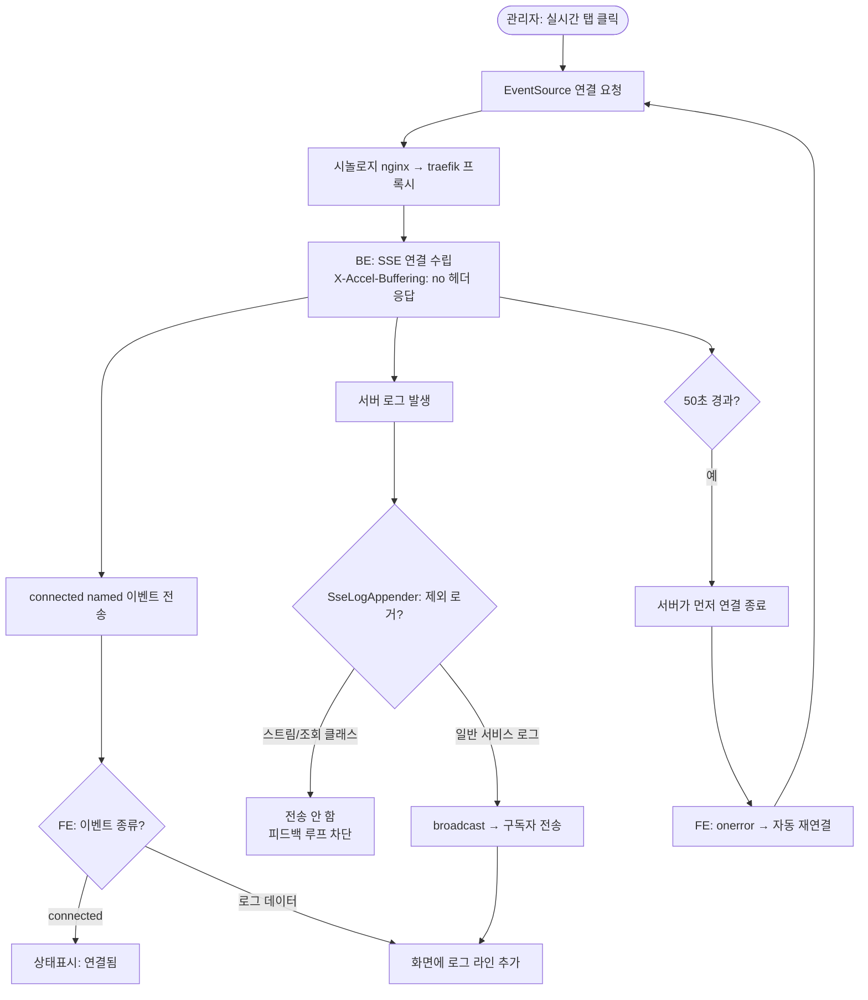

# 관리자 실시간 로그 스트림 — SSE 프록시 버퍼링 해제 및 자기 오염 방지

## 개요

관리자 로그 관리 화면(`/admin/logs`)의 **실시간 탭에서 서버 로그가 보이지 않고 "연결 끊김"만 반복**되던 문제를 수정했다. 원인은 리버스 프록시(시놀로지 nginx → traefik)가 SSE(`text/event-stream`) 응답을 버퍼링하거나 idle 타임아웃으로 조기 종료(`Connection closed before full header was received`)했기 때문이다. SSE 응답에 프록시 버퍼링 해제 헤더를 추가하고 서버 타임아웃을 프록시보다 짧게 잡아 끊김 타이밍을 예측 가능하게 했으며, 프론트엔드는 `connected` named 이벤트 수신과 자동 재연결을 갖추도록 보강했다. 추가로 실시간 로그 스트리밍 동작 자체가 다시 로그로 잡혀 SSE에 되먹임되는 자기 오염(피드백 루프)을 차단하고, 에러 대시보드에 정렬 필터(많은순/최근순)를 더했다.

## 기능 흐름

## 변경 사항

### 실시간 로그 미표시 수정 (프록시 대응)
- `RomRom-Web/.../controller/api/AdminApiController.java`: `streamLogs()` 반환 타입을 `ResponseEntity<SseEmitter>`로 변경하고 응답에 `X-Accel-Buffering: no`, `Cache-Control: no-cache`, `Connection: keep-alive` 헤더 추가. SSE 타임아웃을 300초 → **50초**로 단축(프록시 read timeout 60초보다 짧게).
- `RomRom-Web/.../controller/api/DebugController.java`: Flutter 테스트 앱이 쓰는 `/api/app/debug/log-stream`에도 동일한 프록시 버퍼링 해제 헤더와 50초 타임아웃 적용(`sseResponse()` 헬퍼로 래핑).
- `RomRom-Web/.../controller/api/DebugControllerDocs.java`: 반환 타입을 `ResponseEntity<SseEmitter>`로 맞추고 `@ApiChangeLog` 및 동작 설명 갱신.
- `RomRom-Web/src/main/resources/static/js/admin-logs.js`: `connected` named 이벤트를 `addEventListener`로 수신(기존 `onmessage`만으로는 수신 불가), `onerror` 시 1초 후 자동 재연결, 연결 상태 표시(연결 중/연결됨/재연결 중/연결 안 됨) 정확화.

### 자기 오염(피드백 루프) 방지
- `RomRom-Common/.../logging/SseLogAppender.java`: SSE 전송 제외 로거 목록에 `AdminApiController`와 `LogFileService` 추가. 로그를 보는 행위(스트림 컨트롤러·로그 조회 서비스)가 다시 SSE로 전송되어 되먹임되는 것을 차단.
- `AdminApiController.java`: `streamLogs()`에서 `@LogMonitor` 제거 — 실시간 스트림 연결 자체가 요청 로그를 생성하지 않도록.

### 에러 대시보드 정렬 필터
- `RomRom-Application/.../service/LogFileService.java`: `aggregateErrors(int, String sortBy)`로 시그니처 확장. `count`(발생 횟수 많은순, 기본) / `recent`(마지막 발생 최근순) 분기. null 시각은 항상 뒤로 정렬.
- `RomRom-Application/.../dto/AdminRequest.java`: `logErrorSortBy` 필드 추가.
- `RomRom-Web/.../controller/api/AdminApiController.java`: `aggregateLogErrors`에서 `logErrorSortBy`(기본 `count`)를 서비스로 전달, `@ApiChangeLog`·`@Operation` 갱신.
- `RomRom-Web/src/main/resources/templates/admin/logs.html`: 에러 대시보드에 정렬 셀렉터(많은순/최근순) 추가.
- `RomRom-Web/src/main/resources/static/js/admin-logs.js`: `runErrors()`가 `logErrorSortBy`를 함께 전송.
- `RomRom-Application/.../service/LogFileServiceTest.java`: 변경된 시그니처 반영 및 정렬(많은순/최근순) 검증 테스트 추가.

## 주요 구현 내용

- **프록시 버퍼링의 두 가지 차단 지점**: nginx 계열 프록시는 `X-Accel-Buffering: no` 응답 헤더를 만나면 해당 응답만 버퍼링을 끈다. 이를 통해 SSE 청크가 모이지 않고 즉시 전달된다. 다만 버퍼링과 별개로 idle 타임아웃에 의한 연결 종료는 헤더로 막을 수 없으므로, 서버 타임아웃(50초)을 프록시 read timeout(기본 60초)보다 짧게 두어 **서버가 먼저 깔끔히 닫고 프론트가 곧바로 재연결**하는 구조로 안정화했다.
- **named 이벤트 수신**: 브라우저 `EventSource.onmessage`는 이름 없는 `message` 이벤트만 받는다. 서버가 `.name("connected")`로 보낸 연결 확인 이벤트는 `addEventListener('connected', ...)`로만 잡히므로 이를 추가했다. 실제 로그는 이름 없는 데이터 이벤트라 `onmessage`로 수신된다.
- **자기 오염 차단 원리**: 실시간 로그를 보는 동안 스트림 컨트롤러/조회 서비스가 남기는 로그가 다시 `SseLogAppender`를 거쳐 SSE로 전송되면 무한 되먹임이 발생한다. 해당 로거들을 제외 목록에 넣어 broadcast 단계에서 걸러낸다. 파일(`romrom.log`) 기록은 별도 appender이므로 평소 서비스 로그는 그대로 보존된다.

## 주의사항

- 본 변경은 **프록시 구조가 2단(시놀로지 nginx → traefik)** 이라는 점을 전제로 한다. BE 헤더만으로 해결되지 않고 `Connection closed`가 재발하면, 시놀로지 nginx의 `Connection: $connection_upgrade` 헤더(WebSocket 채팅용)가 SSE 연결을 끊는 원인일 수 있다. 이 경우 SSE 전용 서브도메인(예: `stream.romrom...`)을 분리해 Connection 헤더 없이 SSE만 처리하는 프록시 규칙을 두는 방식이 채팅 WebSocket을 깨지 않으면서 근본 해결하는 경로다.
- 시놀로지 역방향 프록시 고급 설정에서 **Proxy Read Timeout을 300초**로 늘리는 것을 함께 권장한다(BE 50초 타임아웃이 항상 먼저 발동하도록).
- 빌드/배포는 내부망 환경에서 별도로 수행하며, 실시간 로그 표시 여부는 배포 후 실제 프록시 경유로 검증이 필요하다.
