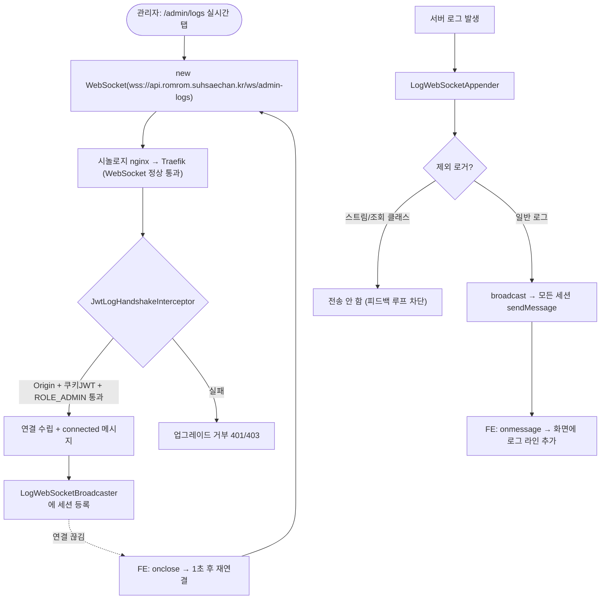

# 관리자 실시간 로그 — SSE → WebSocket 전환 설계

## 개요

관리자 로그 관리 화면(`/admin/logs`)의 실시간 로그 스트림을 **SSE에서 WebSocket으로 전환**한다. 근본 원인은 인프라(시놀로지 nginx 역방향 프록시)가 WebSocket 통과 전용으로 설정돼 있어 SSE가 끊기는 것이고, WebSocket으로 가면 인프라를 전혀 건드리지 않고 해결된다.

## 배경 — 왜 SSE가 안 되는가 (진단 완료)

### 트래픽 경로
```
인터넷 → [시놀로지 nginx (GUI 역방향 프록시)] → [Traefik :8079] → [romrom-back :8080]
```

### 진단 결과
시놀로지 nginx의 `api.romrom.suhsaechan.kr` 규칙(`localhost:8079`)에 WebSocket 채팅용 헤더가 박혀 있다:
```nginx
proxy_set_header Connection $connection_upgrade;
# nginx.conf 상단 map 정의:
map $http_upgrade $connection_upgrade {
    default upgrade;
    ''      close;   # ← Upgrade 헤더 없는(=비 WebSocket) 요청은 Connection: close
}
```

- SSE 요청은 WebSocket이 아니므로 `Upgrade` 헤더가 없음 → `$connection_upgrade`가 **`close`**로 평가
- nginx가 백엔드로 `Connection: close`를 전달 → SSE의 장시간 연결이 헤더 수신 전 끊김 (`Connection closed before full header was received`)
- 타임아웃은 이미 600초로 넉넉함 → **순수하게 `Connection: close` 헤더 하나가 원인**

### 인프라를 못 고치는 이유
- 시놀로지 역방향 프록시 설정은 GUI가 관리하는 nginx conf라, SSH로 직접 편집하면 GUI에서 충돌/버그 발생
- SSE 유지 시 필요한 작업: nginx GUI 서브도메인 추가 + Traefik 라벨(`Host` 규칙) 추가 + CICD yaml 수정 + 재배포
- **WebSocket 전환 시 필요한 인프라 작업: 0** (프록시가 이미 WebSocket을 통과시킴)

Traefik 자체는 SSE/WebSocket 모두 잘 통과시키므로 범인이 아니다. 범인은 시놀로지 nginx의 `Connection: close` 하나다.

## 결정 사항 (브레인스토밍 확정)

| 항목 | 결정 | 근거 |
|------|------|------|
| 프로토콜 | WebSocket | 인프라 무수정. 프록시가 이미 통과시킴 |
| 메시지 경로 | **서버 내부(in-memory) broadcast** | 로그는 그 JVM logback에서 발생 → 그 서버가 직접 구독자에게 전송. RabbitMQ 불필요 |
| 구현 방식 | **순수 WebSocket 핸들러** (`TextWebSocketHandler`) | 방식 A(브로커 없음)에 정확히 부합. 채팅 STOMP 코드 무수정 |
| 기존 SSE | **완전 제거 후 WebSocket으로 교체** | 코드 중복 제거. broadcaster/appender 로직은 재활용 |
| 관리자 인증 | handshake 시 **쿠키 JWT + ROLE_ADMIN + Origin 검증** | 관리자는 이미 쿠키 accessToken 보유 |
| Flutter 테스트앱 인증 | handshake 시 **HMAC 서명** (로그인 불필요) | 기존 `@SecuredApi` 방식 그대로. 로그인 안 해도 동작 |

## 아키텍처

```
[romrom-back JVM]
   logback 로그 발생
     ▼
   LogWebSocketAppender        ← com.romrom 패키지 필터 + 피드백 루프 차단 (기존 SseLogAppender 로직 재활용)
     ▼
   LogWebSocketBroadcaster     ← 구독자 목록 + rate limiting + skip 알림 (기존 SseLogBroadcaster 로직 재활용)
     │                            전송 매체만 SseEmitter → WebSocketSession 으로 교체
     ├─ /ws/admin-logs   ← JwtLogHandshakeInterceptor  (Origin 화이트리스트 + 쿠키 JWT + ROLE_ADMIN)
     └─ /ws/debug-logs   ← HmacLogHandshakeInterceptor (X-Timestamp + X-Signature HMAC 검증)
     ▼
   WebSocketSession.sendMessage(JSON)
     ▼
[관리자 웹 (admin-logs.js)]  /  [Flutter 테스트앱]
```

두 핸들러(`/ws/admin-logs`, `/ws/debug-logs`)는 **동일한 `LogWebSocketBroadcaster`를 공유**하고, handshake 인증 방식만 다르다. broadcaster/appender는 한 벌만 만든다.

## 보안 설계

### 채팅 WebSocket의 현황 (참고 — 약점 존재)
- `messaging.websocket.allowed-origins: ["*"]` (prod) → **CSWSH(Cross-Site WebSocket Hijacking) 방어 없음**
- `/chat/**`를 Security 필터에서 완전 제외(`web.ignoring()`), 인증은 STOMP CONNECT 시 `CustomChannelInterceptor`가 JWT 검증
- 순수 WebSocket(로그)은 STOMP CONNECT 프레임이 없으므로 이 패턴을 그대로 쓰면 인증이 통째로 빠진다 → **handshake 단계 인증 필수**

### 로그 WebSocket 보안 (채팅보다 엄격하게)

| 보안 항목 | 채팅(현재) | 로그 WS(설계) |
|---|---|---|
| 인증 | JWT (CONNECT) | JWT(admin) / HMAC(debug) (handshake) |
| Origin 검증 | ❌ `*` | ✅ 화이트리스트 (admin 경로) |
| 권한 검증 | 일반 회원 | ✅ ROLE_ADMIN 전용 (admin 경로) |
| 인증 시점 | 연결 후 STOMP 프레임 | **연결 수립 전 handshake** (미인증 시 업그레이드 자체 거부) |

### `/ws/admin-logs` 인증 흐름
```
HandshakeInterceptor.beforeHandshake():
  ① Origin 헤더 검증 — romrom.xyz / *.romrom.xyz / admin.romrom.suhsaechan.kr / localhost  (CSWSH 차단)
  ② 쿠키 accessToken 추출 → JwtUtil.validateToken()
  ③ ROLE_ADMIN 권한 확인
  → 셋 다 통과해야 true 반환(연결 수립), 하나라도 실패 시 false (401/403, 업그레이드 거부)
```

### `/ws/debug-logs` 인증 흐름 (Flutter)
```
HandshakeInterceptor.beforeHandshake():
  ① X-Timestamp, X-Signature 헤더 추출
  ② SignatureUtil.verify() — HMAC-SHA256(timestamp, secretKey) 검증 (기존 SecuredApiAspect 로직 재사용)
  ③ timestamp 만료(SecuredApiProperties) 검증
  → 통과 시 연결, 로그인 불필요
```

> Flutter WebSocket 클라이언트가 handshake 요청 헤더에 `X-Timestamp`/`X-Signature`를 실을 수 있어야 한다(대부분의 WebSocket 라이브러리가 custom header 지원). 브라우저 `WebSocket` API는 custom header 미지원이지만, debug 경로는 Flutter 네이티브 클라이언트라 문제없음.

## 파일별 작업

### 신규 (RomRom-Common)
- `com.romrom.common.logging.LogWebSocketHandler` — `TextWebSocketHandler`. `afterConnectionEstablished`에서 broadcaster에 세션 등록, `afterConnectionClosed`에서 제거. 연결 즉시 `connected` 메시지 1회 전송
- `com.romrom.common.service.LogWebSocketBroadcaster` — 기존 `SseLogBroadcaster`의 구독자 관리/rate-limit(초당 100)/skip 알림/최대 구독자(10) 로직을 `WebSocketSession` 기반으로 포팅. `broadcast(DebugLogEvent)`가 모든 세션에 `sendMessage(TextMessage(json))`
- `com.romrom.common.logging.LogWebSocketAppender` — 기존 `SseLogAppender`와 동일(com.romrom 필터 + 피드백 루프 제외 로거 목록). broadcaster 빈만 교체. 제외 목록의 로거 클래스명도 신규 클래스명으로 갱신
- `LogWebSocketConfig` (`@EnableWebSocket`, `WebSocketConfigurer`) — `registerWebSocketHandlers`로 `/ws/admin-logs`(+JwtLogHandshakeInterceptor), `/ws/debug-logs`(+HmacLogHandshakeInterceptor) 등록. 채팅 STOMP Config와 완전 별개
- `JwtLogHandshakeInterceptor`, `HmacLogHandshakeInterceptor` — 위 인증 흐름 구현

### 수정
- `logback-spring.xml` — `SseLogAppender` → `LogWebSocketAppender` 교체
- `SecurityConfig.webSecurityCustomizer()` — `/ws/**`를 Security 필터에서 제외(또는 permitAll). 인증은 handshake 인터셉터가 담당
- `admin-logs.js` — `EventSource` → `WebSocket`. `onclose` 시 자동 재연결(1초 후), `onmessage`로 로그 수신, 연결 상태 표시 유지
- `logs.html` — 연결 상태 UI 유지 (변경 최소)
- Flutter(RomRom-FE) — SSE 클라이언트 → WebSocket 클라이언트(handshake에 HMAC 헤더). **별도 이슈/PR**

### 제거 (SSE 완전 교체)
- `SseLogBroadcaster.java`, `SseLogAppender.java`
- `AdminApiController.streamLogs()` + `sseStreamResponse()` + 관련 상수/`logHeartbeatScheduler`
- `DebugController.streamDebugLog()` + `sseResponse()` + heartbeat 스케줄러
- `DebugControllerDocs`의 SSE 시그니처
- `SecurityUrls.ADMIN_PATHS`에서 `/api/admin/logs/stream` 제거, `SECURED_API_URLS`에서 `/api/app/debug/log-stream` 제거
- **`DebugLogEvent` DTO는 그대로 재활용** (제거하지 않음)

## SSE 코드에서 보존해야 할 핵심 로직 (포팅 시 유지)

기존 SSE 구현에 검증된 로직이 있으므로 WebSocket으로 옮길 때 빠뜨리지 않는다:
- **피드백 루프 차단**: 스트림 핸들러/조회 서비스가 남기는 로그가 다시 broadcast 되지 않도록 `LogWebSocketAppender` 제외 로거 목록 유지 (신규 클래스명으로 갱신)
- **rate limiting**: 초당 100건 초과 시 skip + "[N건 생략]" 알림 (로그 폭주로 WebSocket 세션이 막히는 것 방지)
- **최대 구독자 수**: 10명 초과 시 연결 거부
- **connected 초기 메시지**: 연결 직후 1회 전송 (클라이언트 연결 확인용)

## 동작 흐름



## 주의사항 및 후속 권장

- **인프라 무수정**: 본 전환의 핵심 가치. nginx GUI / Traefik 라벨 / CICD yaml 모두 건드리지 않는다
- **Flutter는 별도 PR**: BE WebSocket 엔드포인트 완성 후 FE 클라이언트 전환. 그 전까지 Flutter 디버그 로그는 잠시 동작 안 할 수 있음(테스트 빌드 전용이라 영향 제한적)
- **후속 권장(범위 밖)**: 채팅 WebSocket의 `allowed-origins: ["*"]`도 화이트리스트로 좁히면 CSWSH 방어 강화. 별도 보안 이슈로 분리
- **Blue/Green**: 배포 순간 2대 동시 기동 시, 관리자는 접속한 서버의 로그만 본다. 평소 1대만 활성이라 실질 영향 없음
